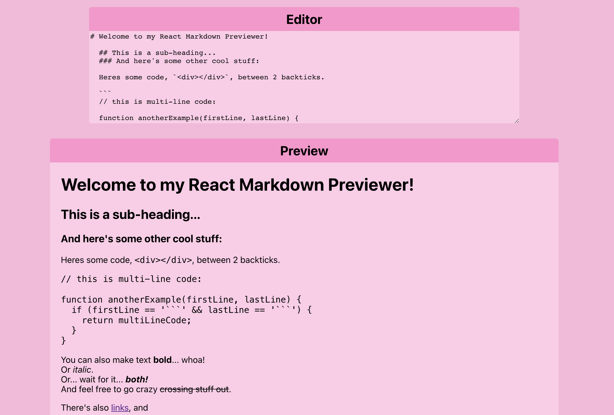
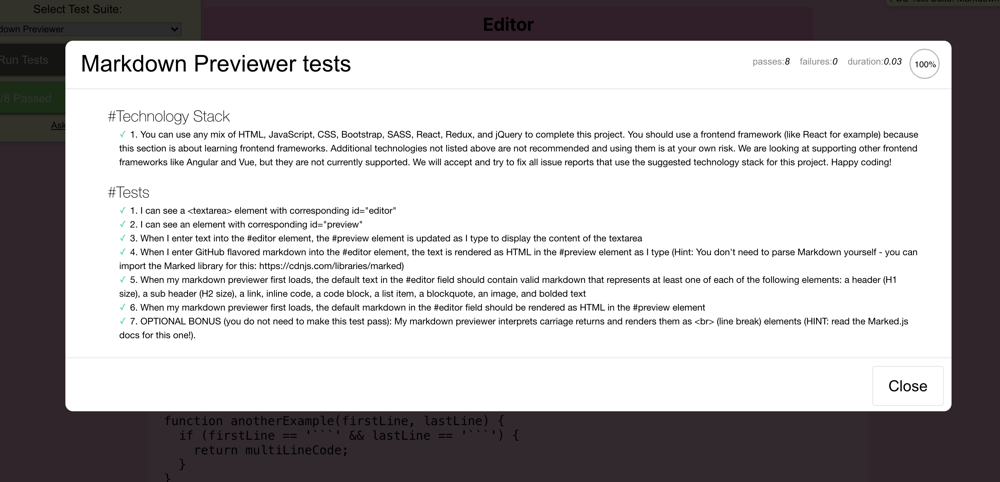

# Markdown Editor

This project was created using React, Redux, HTML, CSS &MarkedJS.

Deployed on github pages - [Check It Out](https://natalievasquez11.github.io/markdown-editor/)

## What it is

A markdown editor project from [freecodecamp's frontend certification](https://www.freecodecamp.org/learn/front-end-development-libraries/front-end-development-libraries-projects/build-a-markdown-previewer) using the Marked Library.

## Freecodecamp's test results

Here is a screenshot of the test results from freecodecamp's test suite
